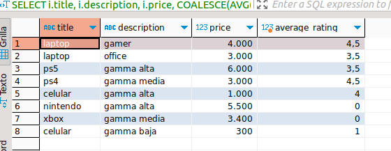
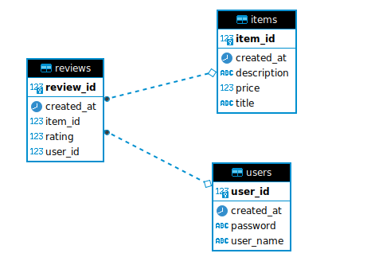
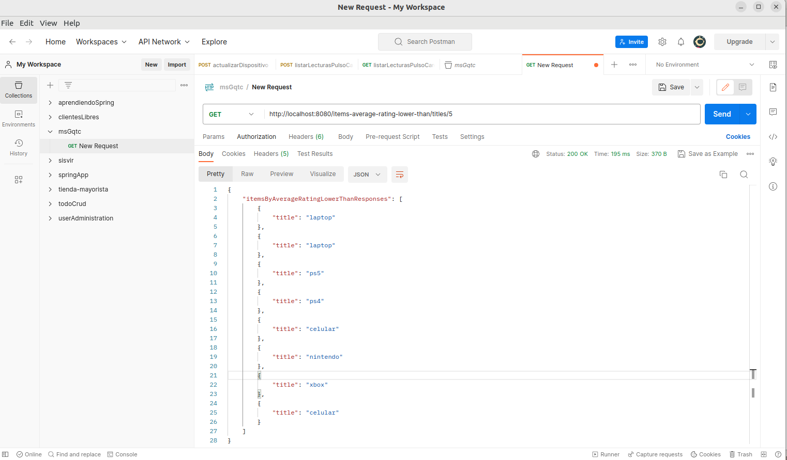

# ms-challenge-Gqtal
Microservicio

- Capa de persistencia – un paquete dao responsable de recuperar data representada por las entidades Item, Review y User en el paquete model 

- Capa de servicio – un paquete service responsable de la lógica del negocio 

- Capa web – un paquete controller que sirve como endpoint REST 

Definición de la tarea Por favor implemente los siguientes métodos: 
- **ItemRepository** List findItemsWithAverageRatingLowerThan(Double rating) – el método deberá encontrar todos los items que tienen un rating menor que el rating pasado como argumento. Use los reviews asociados con cada item para calcular el rating del item. Si no hay ningún review para un item, entonces su rating deberá ser cero. Su implementación deberá hacer la menor cantidad de viajes de ida y vuelta a la base de datos. 

- **ItemService** List getTitles(Double rating) – el método deberá recuperar data usando ItemRepository y devolverá solo los títulos de los ítems. 

- **ItemController** List getTitles(Double rating) – el métodos deberá proveer un endpoint REST (método GET) bajo la ruta '/titles' y devolverá títulos del ItemService en formato JSON con codificación UTF

### Consulta SQL para obtener los items menores a un rating indicado
```
SELECT i.title, i.description, i.price, COALESCE(AVG(r.rating), 0) AS average_rating
FROM msgqtc.msgqtc.items i
left join msgqtc.msgqtc.reviews r on r.item_id = i.item_id 
group by i.title, i.description, i.price
HAVING COALESCE(AVG(r.rating), 0) < 5;
```


### Diagrama BD con PosgrestSQL


### Listar títulos de los items


Endpoint REST (método GET) devuelve títulos del ItemService en formato JSON con codificación UTF, se le pasa un parámetro extra en este caso será el rating.
Y solo mostrará los items menores al rating ingresado.
